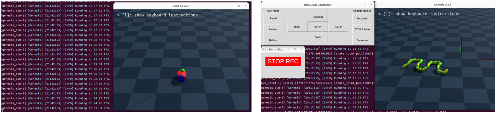
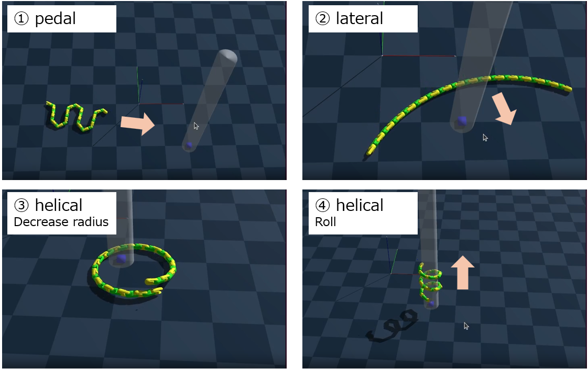

# simple_ros2_genesis_sim
Simply send target joint angles from ROS 2 to control the robot in Genesis. This repository also includes an example program to control a snake robot.  
When looking to try out a robot model using ros, Gazebo seemed a bit complicated for a beginner, so I made this. If you want to try out detailed control of your robot, try Gazebo.
[https://tototototototo7.hatenablog.com/entry/2025/simple_ros2_genesis_sim](https://tototototototo7.hatenablog.com/entry/2025/simple_ros2_genesis_sim)


## Test Environment
- OS: Ubuntu 22.04  
- ROS 2: Humble  
- genesis-world: 0.2.1  
- torch: 2.6.0+cpu  

## Install Genesis
Install Genesis according to [https://github.com/Genesis-Embodied-AI/Genesis](https://github.com/Genesis-Embodied-AI/Genesis).
```bash
# Install torch according to https://pytorch.org/
```
```bash
pip3 install genesis-world
```

## Build
```bash
mkdir -p ~/simple_ros2_genesis_sim_ws/src
cd ~/simple_ros2_genesis_sim_ws/src
git clone https://github.com/tototototototo07/simple_ros2_genesis_sim.git
cd ..
colcon build
source install/setup.bash
```

## Usage
### Included Example Packages
- example_sim  
  Operate a very simple differential two-wheeled robot. Target angles change with time passed.  
- franka_sim  
  Operate a Franka arm (in Genesis tutorial). Target angles change with time passed.  
- snake_sim  
  Operate a snake robot. **You can use GUI to move the robot and switch between pedal, lateral, and helical gait. See below for more details.**  

When using your own model:  
1. Describe the path to the model in ```launch/bringup.launch.py```.  
2. Describe the joint names in ```config/parameter.yaml```.  
3. Describe the details about ```/target_pos``` in ```src/publisher_joint_target.cpp```.  

### Command  
If executing ```example_sim```,  
```bash
ros2 launch example_sim bringup.launch.py
```
If you want to use recording or gpu,  
```bash
ros2 launch example_sim bringup.launch.py recording:=true use_gpu:=true
```
To stop recording, press the “STOP REC” button on the GUI. When finished saving the video, press ```ctrl+c``` to exit the program.  
If you want to place objects in the simulation environment, edit ```/simple_genesis_sim/simple_genesis_sim/genesis_sim.py``` and set ```put_objects:=true```.

## snake_sim GUI  



### Gait  
When the button is pressed, the robot transitions to the corresponding gait. Pressing the same button as the current gait reverses the shape.  
### Move  
- Forward/Back  
  Move the position back and forth on the target curve. Mainly used when pedal gait.
- Roll L/R  
  Make the motion rotate while maintaining the shape. When pedal and lateral gait, it is used for lateral movement, and when helical gait, it is used for movement along the axis.
### Change radius  
Change the radius of lateral and helical gait. The change rate varies depending on whether the current radius is large or small. 
